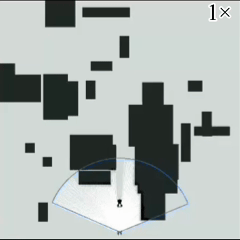
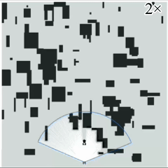

# DiffTrack

## Introduction

__DiffTrack__ is an efficient and robust motion planning framework for differential robots to autonomously track targets.

<table>
    <tr>
        <td style="text-align: center;">
            
        </td>
        <td style="text-align: center;">
            
        </td>
    </tr>
</table>

## Quick Start

In Ubuntu 24 & ROS-jazzy:

```shell
git clone https://github.com/Yue-0/DiffTrack
cd DiffTrack && colcon build
```

Launch the simulator:

```shell
source install/setup.zsh
ros2 launch simulator simulation.launch.py
```

Launch the tracker in another terminal, the tracker will track the target autonomously:

```shell
cd DiffTrack
source install/setup.zsh
ros2 launch tracker tracking.launch.py
```

Use `2D Goal Pose` to control the target's movement, or press the `U` key and click on the map to initiate the target's random movement.
